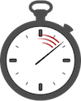

# Chronex
[](https://travis-ci.org/efcasado/chronex)
[](https://coveralls.io/github/efcasado/chronex?branch=master)
[](https://hex.pm/packages/chronex)
[](https://hex.pm/packages/chronex)
[](https://choosealicense.com/licenses/mit/)




A small library to seamlessly add code instrumentation to your Elixir projects.

The documentation for this project is available at
[HexDocs](https://hexdocs.pm/chronex/api-reference.html).


## Quick Start

`Chronex` implements a dead simple API consisting of only three functions,
`bind/3`, `unbind/3` and `bound?/3`. All three functions take 3 arguments
as input. A module name, a function name and an arity. These three arguments
are used to identify the target function.

`bind/3` is used to attach a stopwatch to the given function. `unbind/3` is
used to detach a stopwatch from the given function. Last but not least,
`bound?/3` is used to check if the given function has a stopwatch attach to
it.

> Chronex needs write access to the beam files where the target functions
> are implemented. Thus, you will need to run as root should you want to
> experiment adding code instrumentation to core functions.

```elixir
str = "Hello, world!"
String2.length(str)
# => 13

# Attach a stopwatch to String2.length/1
:ok  = Chronex.bind(String2, :length, 1)
true = Chronex.bound?(String2, :length, 1)

String2.length(str)
# STDOUT: 15:53:09.917 [debug] chronex | hook=:before mfa="Elixir.String2.length/1" args=["Hello, world!"] uuid="39c120fa-3264-11e8-afec-600308a32e10"
# STDOUT: chronex | hook=:after_return mfa="Elixir.String2.length/1" return=13 duration=0.003 uuid="39c120fa-3264-11e8-afec-600308a32e10"
# => 13

# Detach the stopwatch from String2.length/1
:ok   = Chronex.unbind(String2, :length, 1)
false = Chronex.bound?(String2, :length, 1)

String2.length(str)
# => 13
```


## Backends

`Chronex` implements four hooks:

- `before` - Executed before the target function is called.
- `after_return` - Executed right after the target function returns.
- `after_throw` - Executed right after the target function throws a value (i.e.
`catch` clause in a `try` block).
- `after_raise` - Executed right after the target function raises an error
(i.e. `rescue` clause in a `try` block).

`Chronex` ships with a `Logger` backend that can be used to log interesting
information surrounding the invocation of the instrumented functions. New
backends can easily be implemented by simply writting a module that implements
the four hooks listed above.

To configure the list of backends, just do as follows:

```
config :chronex, backends: [
  Chronex.Backends.Logger
]
```

Note that you can have more than one backend enabled at the same time.

To configure the log level of the Logger backend, just add the following
line to your config file:

```elixir
config :chronex, Chronex.Backends.Logger,
  log_level: :debug
```


## Author(s)

- Enrique Fernandez `<efcasado@gmail.com>`


## License

> The MIT License (MIT)
>
> Copyright (c) 2018, Enrique Fernandez
>
> Permission is hereby granted, free of charge, to any person obtaining a copy
> of this software and associated documentation files (the "Software"), to deal
> in the Software without restriction, including without limitation the rights
> to use, copy, modify, merge, publish, distribute, sublicense, and/or sell
> copies of the Software, and to permit persons to whom the Software is
> furnished to do so, subject to the following conditions:
>
> The above copyright notice and this permission notice shall be included in
> all copies or substantial portions of the Software.
>
> THE SOFTWARE IS PROVIDED "AS IS", WITHOUT WARRANTY OF ANY KIND, EXPRESS OR
> IMPLIED, INCLUDING BUT NOT LIMITED TO THE WARRANTIES OF MERCHANTABILITY,
> FITNESS FOR A PARTICULAR PURPOSE AND NONINFRINGEMENT. IN NO EVENT SHALL THE
> AUTHORS OR COPYRIGHT HOLDERS BE LIABLE FOR ANY CLAIM, DAMAGES OR OTHER
> LIABILITY, WHETHER IN AN ACTION OF CONTRACT, TORT OR OTHERWISE, ARISING FROM,
> OUT OF OR IN CONNECTION WITH THE SOFTWARE OR THE USE OR OTHER DEALINGS IN
> THE SOFTWARE.
